# VARAGH features

This page lists everything VARAGH (up to 1.1.0 "Tiger") adds to or changes in
[CrossInk](https://github.com/uxjulia/crossink) v1.6.0. Everything CrossInk and
CrossPoint already do (EPUB/TXT/XTC reading, fonts from the SD card, KOReader
sync, Calibre, OPDS, reading stats, Quick Actions, and so on) is still there;
see [CrossInk's README](https://github.com/uxjulia/crossink#readme) for those.

VARAGH is built for the **Xteink X4 Pro**.

All photos on this page were taken on an X4 Pro running VARAGH 1.0.0, with the
front light on. The picture comparisons in section 7 are computed, not photographed.

**The one setting to make after installing:**
**Settings → Reader → Font Options → Font Family → NotoVazir.**
With NotoVazir as the reader font, every English, German and Persian word,
pronunciation, dictionary entry, highlight and flashcard displays correctly.

---

## Contents

1. [Persian and Arabic](#1-persian-and-arabic)
2. [German → English dictionary](#2-german--english-dictionary)
3. [Touch word selection](#3-touch-word-selection)
4. [Highlights](#4-highlights)
5. [Flashcards](#5-flashcards)
6. [Swipe to delete](#6-swipe-to-delete)
7. [Speed, pictures and battery](#7-speed-pictures-and-battery)
8. [Summer time for the clock](#8-summer-time-for-the-clock)
9. [Pronunciations in menus](#9-pronunciations-in-menus)
10. [VARAGH name and logo](#10-varagh-name-and-logo)
11. [Safe updates](#11-safe-updates)
12. [Apps](#12-apps)
13. [Online dictionary](#13-online-dictionary)
14. [For developers](#14-for-developers)
15. [Planned](#15-planned)

---

## 1. Persian and Arabic

   
  Khayyam's Rubaiyat in Persian, drawn in NotoVazir. Front light on.

### NotoVazir font
One reader font that contains every letter VARAGH needs:

| Part | Letters |
|---|---|
| Noto Serif (Medium, Bold, Italic, Bold Italic) | English, German and other Latin-script languages |
| Vazirmatn (Medium, Bold) | Persian and Arabic, with all joined letter forms |
| Noto Serif + Noto Sans Math | IPA pronunciation letters, arrows, math and other symbols |

- Sizes 10, 12, 14, 16, 18 and 20.
- Anti-aliased edges drawn slightly darker so text reads better on the X4 Pro screen.
- Install: copy `.fonts/NotoVazir` from `varagh-sd-card-*.zip` (in each release)
  to `/.fonts/NotoVazir/` on the SD card.
- Build it yourself: see [docs/varagh/FONTS.md](docs/varagh/FONTS.md).

### Persian books pick a font that can show them
When you open a book whose language is Persian, Arabic, Urdu, Pashto, Sindhi,
Uyghur or Kurdish (or whose title is written in Arabic script), and your reader
font has no Persian letters, VARAGH uses an installed font that does
(NotoVazir) **for that book only**. Your saved font setting is not changed.

### Persian and pronunciations with any reader font
You can choose another reader font, such as Bitter or Literata. When that font
has no Persian letters or pronunciation symbols, VARAGH draws those words in
NotoVazir at the same size, and the rest of the text stays in your font. This
works in:

- books,
- dictionary definitions,
- highlights,
- flashcards.

Covered: Arabic and Persian letters (U+0600–06FF, 0750–077F, 08A0–08FF, and
presentation forms FB50–FDFF and FE70–FEFF) and IPA (U+0250–02FF, 1D00–1DBF).
NotoVazir (or another installed font with those letters) must be in `/.fonts/`.

### Persian words in the dictionary
The Persian zero-width non-joiner (نیم‌فاصله) stays part of the word when you
select it for lookup, so words such as می‌روم are looked up whole.

### Font converter
`fontconvert_sdcard.py` has a new `arabic` preset with every range Persian and
Arabic text needs, including the joined forms.

---

## 2. German → English dictionary

VARAGH ships no dictionary data (each has its own licence). The recommended
German → English dictionary is FreeDict's `deu-eng`, prepared with Inky's
dictionary tools; step-by-step instructions are in
[docs/varagh/DICTIONARIES.md](docs/varagh/DICTIONARIES.md).

<table>
  <tr>
    <td align="center" width="50%" valign="top"> <b>anfangen</b>: German → English entry with its pronunciation and related forms. Front light on.</td>
    <td align="center" width="50%" valign="top">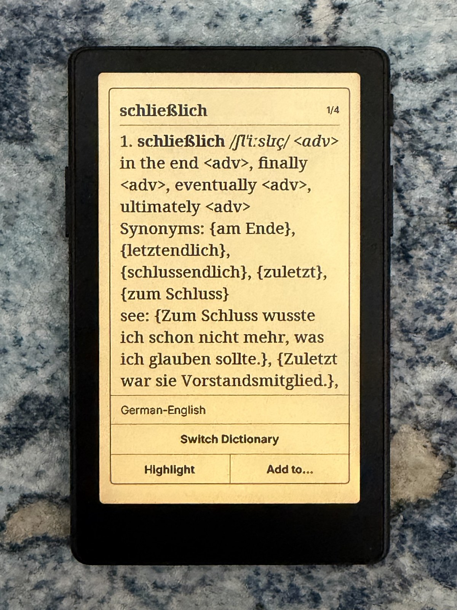 <b>schließlich</b>: pronunciation letters such as ʃ and ç display correctly; <b>Highlight</b> and <b>Add to…</b> at the bottom. Front light on.</td>
  </tr>
</table>

### Finds the dictionary form of German words
When a German word is not in the dictionary as written, VARAGH tries its base
forms, most likely first:

| You select | VARAGH finds | Rule |
|---|---|---|
| Häuser, Mütter, Äpfel | Haus, Mutter, Apfel | umlaut plurals |
| Lehrerinnen | Lehrerin | feminine plural |
| Kindern, schönen | Kind, schön | case and adjective endings |
| größeren, schönsten | groß, schön | comparative and superlative |
| macht, machst, machte, mache | machen | present and past tense |
| gemacht, gearbeitet, gefahren | machen, arbeiten, fahren | past participles |
| die gemachte Arbeit | machen | participles used as adjectives |
| aufgemacht, anzurufen | aufmachen, anrufen | separable verbs |
| Über (start of a sentence) | über | capital letter |

Irregular forms (ging, sah) come from the dictionary's own alternate-forms
file. German rules are used only when the dictionary translates *from* German
(its `lang` field, such as `de-en`, or a name such as "German-English").

### Repairs before lookup
- Curly apostrophes become straight ones (don’t → don't), as headwords use them.
- A hyphen typed into the book text in the middle of a word is removed
  (Geschwin-digkeit → Geschwindigkeit), which is common in books converted from PDF.

### Better word selection
- Punctuation ends a word: "Wort,Wort", "Wort...Wort" and "Wort/Wort" select one word.
- Characters that join words are kept when they sit between letters:
  apostrophes (l'été, don't), hyphens (mother-in-law), abbreviation dots (z.B.),
  the Catalan middle dot and the Persian zero-width (non-)joiners.
- Words split across lines: a hyphen the layout added is dropped
  (exter- / nity → externity), and a hyphen from the book text is kept
  (self- / aware → self-aware).

### Remembers your dictionary
The dictionary you pick with **Switch Dictionary** stays the default for later
lookups. If the book has its own dictionary setting, the book remembers it;
otherwise it becomes the global default.

### Pronunciations and symbols display correctly
IPA (such as [ˈhaʊ̯s]) and symbols in definitions used to show as boxes. With
NotoVazir they are drawn exactly. With other fonts they are borrowed from
NotoVazir (see section 1). Only when no installed font has a symbol does VARAGH
draw the nearest look-alike (arrows, bullets, ≈, ≠, ≤, ✓ and others) or leave it
out. It never draws a box.

---

## 3. Touch word selection

<table>
  <tr>
    <td align="center" width="33%" valign="top">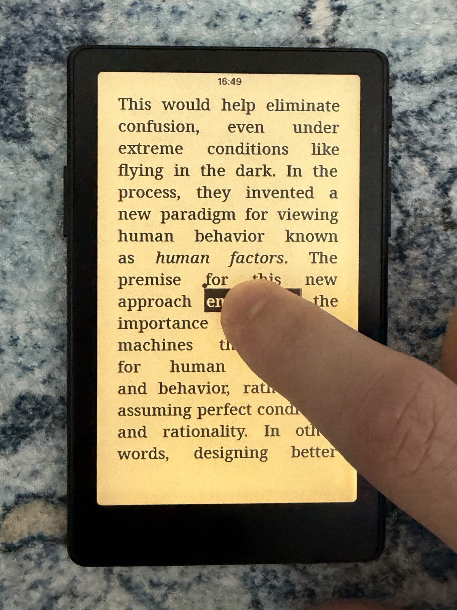 Hold a word until it is selected. Front light on.</td>
    <td align="center" width="33%" valign="top">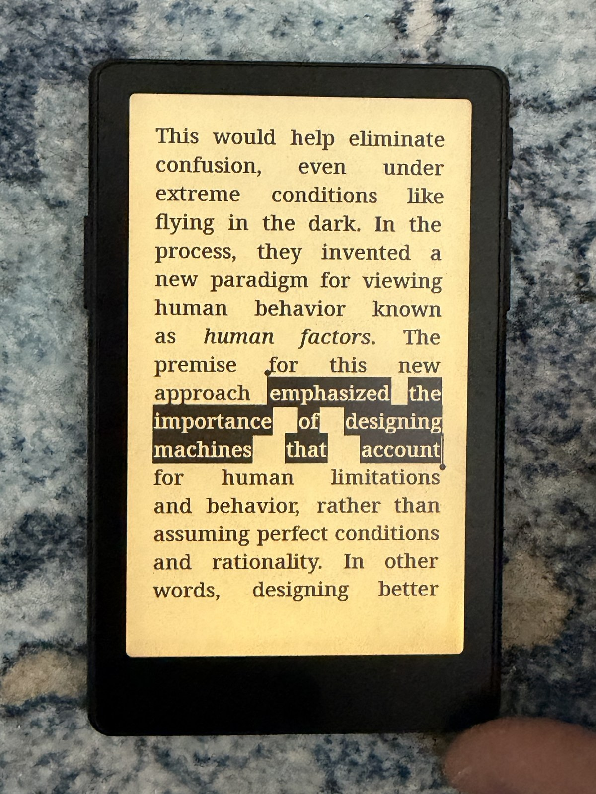 Slide to select more words; handles mark both ends. Front light on.</td>
    <td align="center" width="33%" valign="top">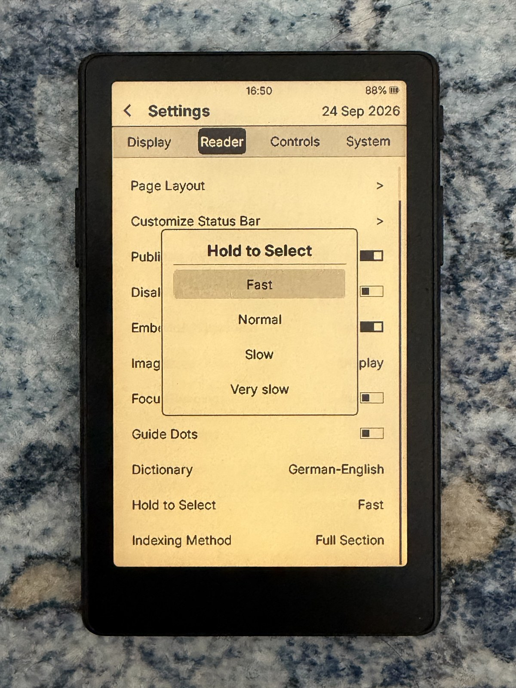 Settings → Reader → <b>Hold to Select</b>. Front light on.</td>
  </tr>
</table>

### Hold to Select (new setting)
**Settings → Reader → Hold to Select** sets how long you hold a finger on a
word before it is selected:

| Option | Hold time |
|---|---|
| Fast | 0.35 s |
| Normal (default) | 0.45 s |
| Slow | 0.7 s |
| Very slow | 1 s (the fixed time CrossInk used) |

It applies in books and when you hold a word inside a dictionary definition to
look that word up too. The setting is shown only on readers with a touchscreen.

**How to use it:** hold a word until it is selected. Keep your finger down and
slide it to select more words; the selection can continue onto the next page.
Lift your finger to look up the word or phrase.

### Selection handles
While you select with your finger, each end of the selection has a bar, with a
round knob above the start and below the end, as on a phone. The handles show
exactly what is selected. To change the selection, keep sliding your finger;
the knobs themselves cannot be dragged.

---

## 4. Highlights

"Clippings" are now called **Highlights** everywhere.

### Highlights hub on the Home screen
**Home → Highlights** is always shown and opens:

| Row | What it holds |
|---|---|
| Favorite Lines | sentences and passages you save |
| Flashcards | words to learn (see section 5) |
| your own categories | anything you want, such as "Verbs" or "Poems" |
| By Book | each book's bookmarks and highlights (the previous screen) |
| New Category | create a category with the on-screen keyboard |

- **Rename** a category: hold its row.
- **Delete** a category: swipe its row left and tap Delete. Favorite Lines,
  Flashcards and By Book cannot be deleted.
- Up to 32 categories.

### Add to… from the dictionary

  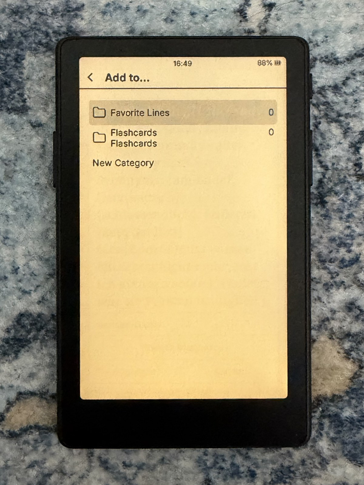 
  <b>Add to…</b>: pick Favorite Lines, Flashcards or one of your categories, or create a new one. Front light on.

The dictionary popup has two buttons below the definition: **Highlight** and
**Add to…**. **Add to…** lets you pick a category:

- In **Flashcards**, the word is saved with its meaning (up to about 1,500
  characters, taken from the dictionary on screen). The card keeps working if
  you later remove or change dictionaries.
- In any other category, the word is saved.
- When the selected text is not in the dictionary (for example a whole
  sentence), **Add to…** saves the text itself, handy for Favorite Lines.

### Reading a category
Tap an entry to read it in full, and swipe an entry left to delete it.

Highlights are plain text files in `/.crosspoint/highlights/` on the SD card,
so they survive firmware updates and can be copied off the card.

---

## 5. Flashcards

<table>
  <tr>
    <td align="center" width="33%" valign="top">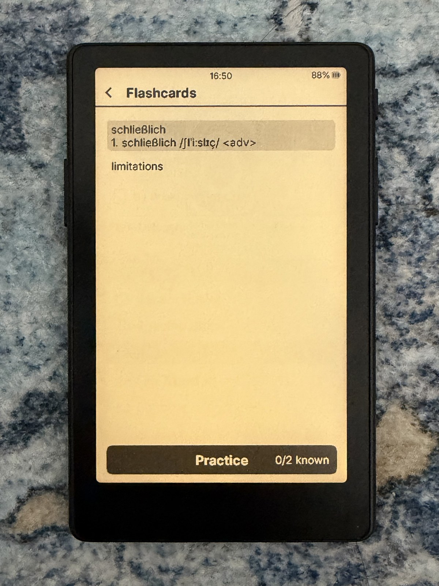 The Flashcards list with the <b>Practice</b> button and how many cards you know. Front light on.</td>
    <td align="center" width="33%" valign="top">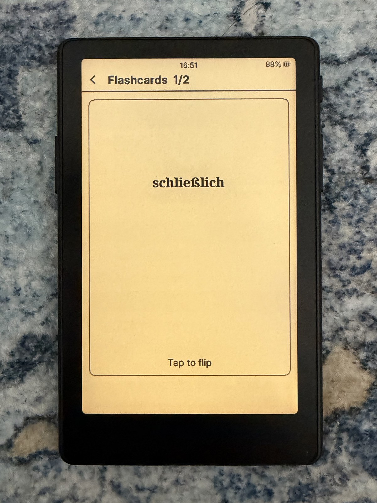 Front of a card: the word. Tap to flip. Front light on.</td>
    <td align="center" width="33%" valign="top"> Back of the card: the saved meaning, then <b>Again</b> or <b>Know it</b>. Front light on.</td>
  </tr>
</table>

The Flashcards category has a **Practice** button at the top that shows how
many cards you already know.

- A card shows the word. **Tap to flip** it and see the meaning.
- Choose **Again** or **Know it**.
- Cards are sorted into Leitner boxes 1–5: **Know it** moves a card up one box,
  **Again** sends it back to box 1. Cards in lower boxes come first, so words
  you miss come back sooner. A card counts as known from box 4.
- At the end: "All cards reviewed" and **Start Over**.
- Progress is saved on the SD card next to the cards.
- German, English, Persian and IPA display correctly on the cards and in the
  list with any SD-card font. Earlier builds showed boxes here.

---

## 6. Swipe to delete

  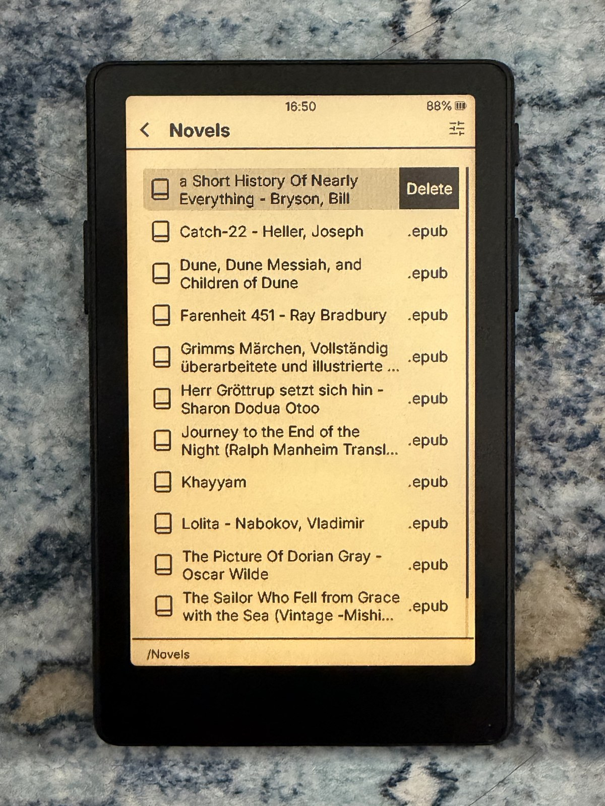 
  A book swiped left in the File Browser, showing <b>Delete</b>. Front light on.

Swipe a row **left** to reveal a **Delete** button, then tap Delete. Tapping
anywhere else, swiping right or pressing any button hides it again.

| Screen | What Delete removes |
|---|---|
| File Browser | the **file** from the SD card (files only; folders still use the action menu) |
| Recent Books | the entry from the list only; the book file stays |
| Highlights hub | a category you created |
| A highlights category | that entry |
| Bookmarks (in a book) | that bookmark |
| Highlights (in a book) | that highlight |
| Lookup history | that word |

---

## 7. Speed, pictures and battery

VARAGH 1.1.0 "Tiger" is about speed and picture quality; the battery savings
from 1.0.0 stay. There is nothing to switch on: everything in this section
works by itself, except the optional Faster Screen Link.

### Smoother, sharper pictures in books (1.1.0)

- Pictures are shrunk by **averaging** every pixel of the original (1.0.1 picked
  every n-th pixel and skipped the rest, which made lines jagged).
- Greys are drawn with **error diffusion**: fine, even dots instead of the fixed
  crosshatch pattern of 1.0.1. Gradients such as skies and faces look smooth.
- A **levels** step turns nearly-white areas white and nearly-black areas black,
  so the paper of scanned pages stays clean instead of turning speckled grey.
- Pictures you already viewed are prepared once more the first time you see
  them after updating. Enlarged pictures keep the previous method, which suits
  enlarging better.

The close-ups below show the same part of the same picture at the same size,
enlarged 2×. Each shows exactly the 4 greys the X4 Pro screen receives,
computed on a computer by VARAGH's own picture code from test pictures.

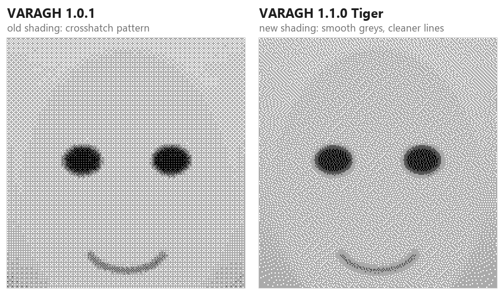

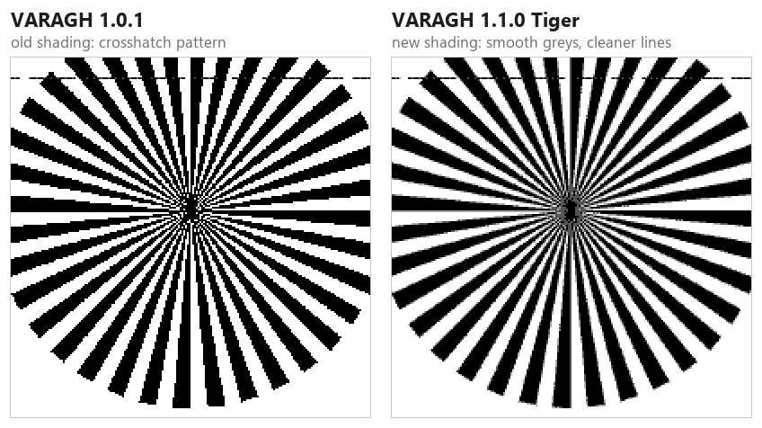

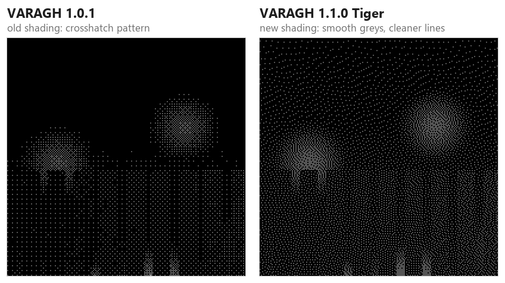

### Chapters open faster (1.1.0)

- **Indexing Method: Automatic** (new default). Before a chapter can be shown,
  the reader lays it out into pages ("indexing"). Normal-size chapters (up to
  32 KB of text) are indexed completely, as before; long chapters show their
  first page right away and are indexed a few pages ahead while you read. You
  can still choose Full Section or Incremental in **Settings → Reader →
  Indexing Method**, or for one book in the reader menu → Reader Options.
  [How indexing works](docs/epub-indexing.md).
- **No "Indexing" popup for quick chapters.** Drawing the popup and the extra
  screen cleaning it caused took about 2.4 seconds, longer than indexing a
  normal chapter.
- **Pages are written to the SD card in large pieces** instead of hundreds of
  small writes: writing was about half of the indexing time.
- **The SD card runs at 40 MHz** (its high-speed mode) instead of 20 MHz: reads
  are about 70% faster. A card that cannot start at 40 MHz falls back to 20 MHz
  by itself.
- **Fonts stay in memory.** Letter shapes of SD-card fonts such as NotoVazir are
  kept in the X4 Pro's 8 MB memory once read, so page turns and indexing no
  longer read them from the card again.
- The book, picture and drawing code is compiled for speed instead of size.

### Battery

- **Display power-off when idle (1.0.0).** After a quick page turn the display
  controller used to keep its power stage running until the next refresh.
  VARAGH turns it off 5 seconds after the screen stops changing, and the next
  refresh turns it back on. Checked against all three X4 Pro panel controllers
  (SSD1677, UC8179, UC8279). Nothing changes on screen.
- **The processor slows down sooner (1.1.0):** 1 second after the last button
  press or touch instead of 3, and also while the screen refreshes. Buttons and
  touch still respond immediately.
- **Faster text drawing** (1.0.0), ported from CrossPoint #3633.
- **Less memory per SD-card font** (1.0.0): fonts share their character tables,
  ported from CrossPoint #3616.
- The Persian/IPA fallback font loads only when a book or screen needs it,
  and reads character widths from the SD card only when needed.

### Faster Screen Link (1.1.0, optional)

**Settings → Display → Faster Screen Link** (off by default) sends each screen
image to the display at 20 MHz instead of 10 MHz, on X4 Pro screens with the
SSD1677 controller. After you turn it on, the reader asks you to confirm within
10 seconds that the screen looks right; without confirmation, or if you leave
Settings first, it switches back by itself. It can only be turned on on the
reader, not from the web settings page.

### Speed log (1.1.0)

The reader writes timings to `/.crosspoint/speed-log.csv` on the SD card: page
turns, chapter indexing (split into its steps), pictures, opening books and
loading Home, plus a battery reading every 5 minutes. It holds timings and
device state only, never titles or text. Send it along when you report that
something is slow.

---

## 8. Summer time for the clock

  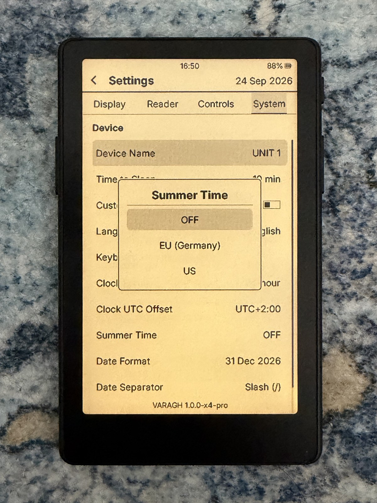 
  Settings → System → Device → <b>Summer Time</b>. The VARAGH version is shown at the bottom. Front light on.

**Settings → System → Device → Summer Time**: Off, EU (Germany) or US. On
readers with a clock, the time then changes automatically on the right dates.
It applies to the clock, reading statistics, the dates saved with highlights,
and file dates on the SD card.

---

## 9. Pronunciations in menus

The built-in menu font (Inter) now includes the IPA letters (U+0250–02FF) at
sizes 8, 10 and 12. Pronunciations in lists and menus, such as the flashcard
list, display correctly instead of as boxes.
You can see it in the [Flashcards list photo](#5-flashcards): the line under
*schließlich* shows `/ʃlˈiːslɪç/`.

---

## 10. VARAGH name and logo

- **Boot screen**: the VARAGH logo with "VARAGH" and "Booting", and at the bottom
  the version with a small tiger: **1.1.0 Tiger**. Settings → System shows
  **VARAGH 1.1.0 Tiger** in the same way.
- **Default sleep screen** (when no custom sleep image is set): the VARAGH logo
  with "VARAGH" and "Sleeping"; inverted in dark mode.
- "VARAGH" in every place the menus said "CrossInk", in every UI language.
- Web file manager: VARAGH logo, name and page titles.
- Network names: Wi-Fi hotspot **VARAGH-Reader**, network name **VARAGH-xxxx**,
  web address **http://varagh.local**, device name **VARAGH X4 Pro**.
- Version numbers start at 1.0.0.
- New menus and messages are in English and German; other languages show them
  in English.

---

## 11. Safe updates

- **Online updates** (Settings → System → Check for Updates) come from VARAGH's
  own GitHub releases, never from CrossInk.
- **Warning before every firmware install**, online or from the SD card:
  installing a CrossInk (or CrossPoint) release replaces VARAGH, and you lose its
  features (highlights, flashcards, German dictionary tools, Persian fonts,
  battery savings).
- When there is no release yet, the reader says **"No update available"**
  instead of showing an error.

---

## 12. Apps

New in 1.2.0. **Apps** on the Home screen opens a tile per app (touch readers,
every theme; in Cover Grid it is the icon of four squares under the covers). **Manage**, top right, lists the apps with a
switch each: an app that is switched off is hidden. The apps are part of the
firmware; a hidden or closed app uses no memory, processor time or battery.
Every game is saved after each move, so leaving it or letting the reader sleep
loses nothing.

### Wordle

- Find the five-letter English word in six tries. Black = right letter in the
  right place, grey = in the word but elsewhere, faded = not in the word. The
  keyboard keys carry the same marks.
- Tap any box of the row you are typing to put the next letter there.
- About 1,900 everyday answers; about 22,000 English words are accepted as
  guesses.
- **Give up** (top right) has to be held. After a round: your statistics, and
  **Look up word** opens the answer in your English dictionary.

### Sudoku

- Tap a cell, then a number. Three levels; every puzzle has exactly one
  solution, and Easy and Medium can be solved without guessing.
- **Notes**: switch it on and the number keys write small numbers into the
  cell, or hold a number key for half a second to write the other kind without
  switching. **Fill** writes every still possible number into all empty cells.
- Undo, Erase and Hint. Each number key shows how many of that digit are still
  missing.
- A wrong digit is not marked and mistakes are not counted while you play.
- **New** (top right) has to be held.

### Chess

- Against the computer (Easy, Medium, Hard) or two people on one reader, as
  White or Black.
- Tap a piece and dots show where it may go; the last move is marked.
- All rules, including castling, en passant, promotion with a choice of piece
  and the draws.
- Undo, Hint and Flip. The computer answers within 1.5, 2.5 or 5 seconds,
  depending on the level.

### Checkers

- American / English rules: pieces move and capture forwards, kings one square
  in any direction, a capture must be taken and a multiple jump finished.
- Against the computer or two players. Undo and Hint.

### Clock

- The time above a month calendar, repainted once a minute while it is open.
  It uses the reader's clock; set it once with Settings → Sync Clock.
- Tap the clock to step through three faces: large digits, an analog clock, and
  a calendar with the Persian day under every date.
- The arrows or a swipe turn the months; tap the month's name to return to
  today.
- **Manage → Clock → Settings**: clock face, Persian date on or off, first day
  of the week (Monday, Saturday or Sunday), week number on or off.
- **Sleep screen**: Settings → Display → Sleep Screen → **Clock & Calendar**
  shows the weekday, a large day number, the month, the Persian date and the
  month's calendar. The reader is off while it sleeps, so there is no time on
  it, and the date is the one of the moment it went to sleep.

---

## 13. Online dictionary

New in 1.2.0. In a word lookup, **Switch Dictionary** ends with **Online
(Wiktionary)**.

- It asks Wiktionary in the language of the word (English, German or Persian)
  and, when Wiktionary has no entry, Wikipedia for a short summary.
- The answer is laid out like the VARAGH dictionaries and saved on the card, so
  the same word is answered offline from then on.
- Normally Wi-Fi is only on for the lookup: the reader restarts into its Wi-Fi
  mode and back into the book, about 10 to 15 seconds for a new word.
- **Settings → Reader → Online Lookup: Keep Wi-Fi On** (off by default,
  experimental): Wi-Fi is joined in the background while a book is open and a
  new word is fetched in a few seconds, without the restarts. Reading uses the
  battery faster while it is on; the reader asks before switching it on. When
  Wi-Fi is not there, the lookup takes the restart route.

---

## 14. For developers

- Licences: MIT like CrossInk and CrossPoint. Every library, font and data
  source is listed in [THIRD_PARTY_NOTICES.md](THIRD_PARTY_NOTICES.md), OFL
  licence texts were added for all built-in fonts, and each release includes a
  full-source zip (the firmware binary includes GPL-licensed wolfSSL).
- The display and UI library (FreeInk SDK) has VARAGH changes: the display idle
  power-off hook, a read-only touch hit-test used by swipe to delete, and in
  1.1.0 the 40 MHz SD card and the Faster Screen Link. The library with these
  changes is in each release's full-source zip.
- Unit tests: German stemming, summer-time rules, glyph drawing, highlight file
  format and storage, lookup-word cleanup; in 1.1.0 also the font memory copy,
  picture shading, the speed log and chapter-file writing; in 1.2.0 the rules
  of Wordle, Sudoku, chess (move generator checked against published position
  counts) and checkers, the calendar arithmetic and the online dictionary text.
- Book page caches were rebuilt once when installing 1.0.0 (layout format v78);
  1.1.0 keeps that format, so books are not indexed again.
- Guides: [fonts](docs/varagh/FONTS.md), [dictionaries](docs/varagh/DICTIONARIES.md),
  [keeping up with CrossInk and CrossPoint](docs/varagh/UPSTREAM-SYNC.md),
  [changelog](CHANGELOG.md).

---

## 15. Planned

- English, German and Persian dictionaries built from Wiktionary, trimmed for
  the reader and published separately under CC BY-SA 4.0.
- Regular merges of new CrossInk and CrossPoint features and fixes.
