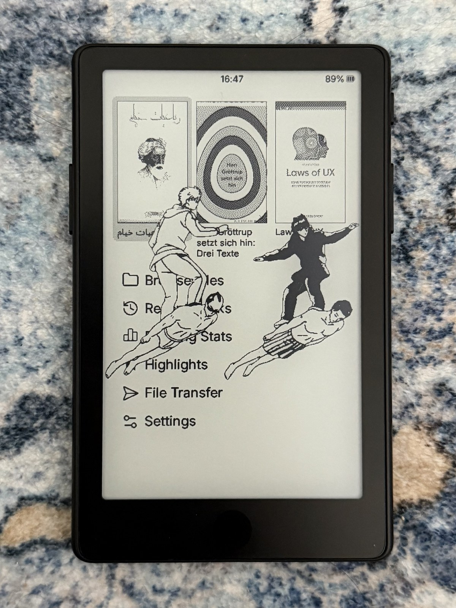
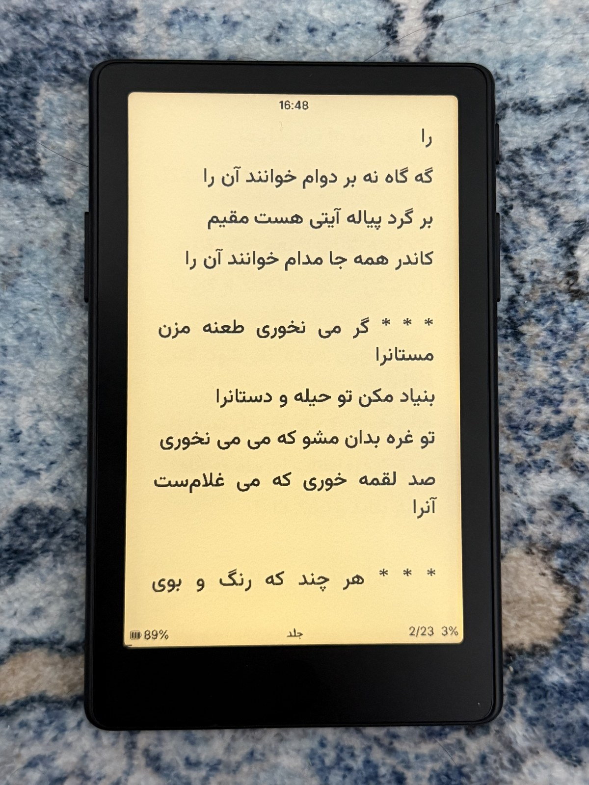
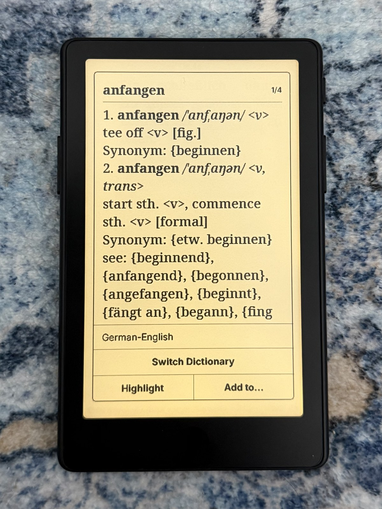
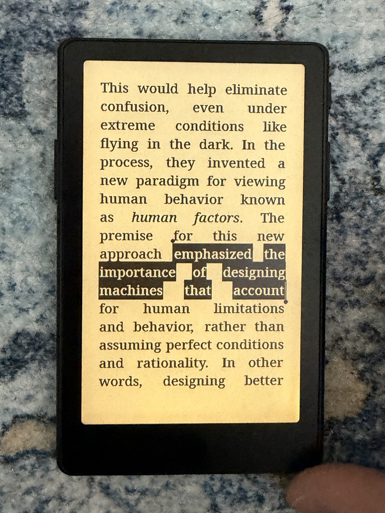
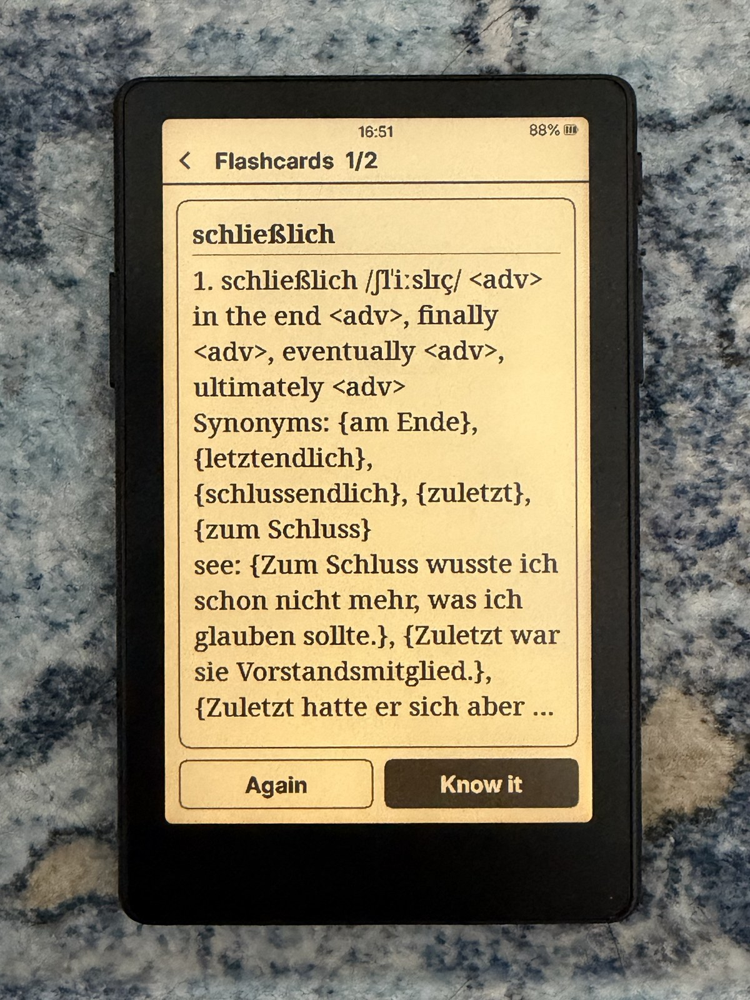
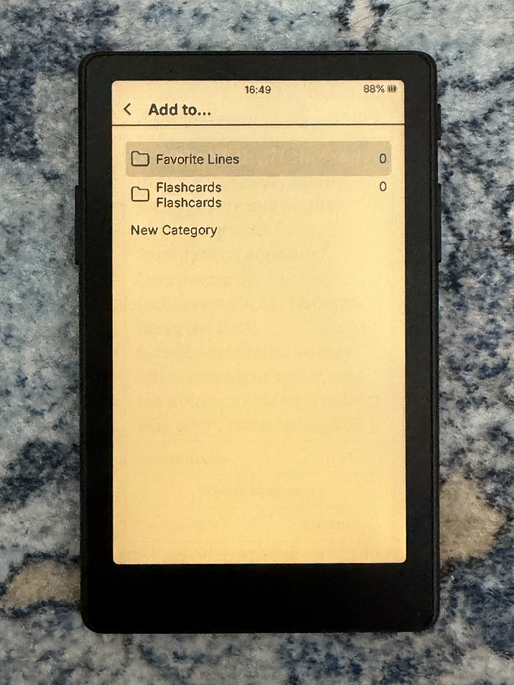
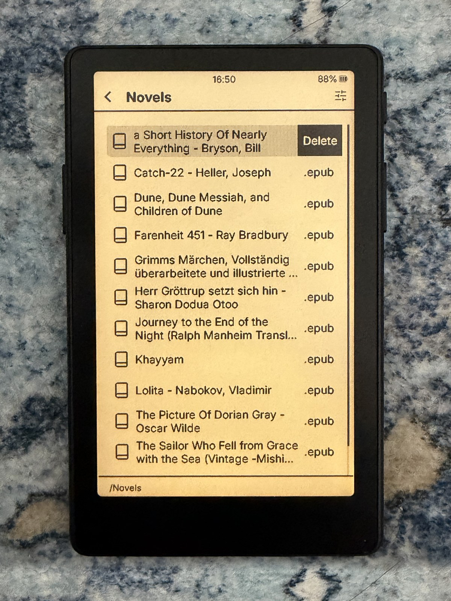

# VARAGH

<p align="center">
  
</p>

**VARAGH** (ورق, Persian for "a sheet / a page") is e-reader firmware for the
**Xteink X4 Pro**, built for reading and learning in **English, German and Persian**.

It is a fork of [CrossInk](https://github.com/uxjulia/crossink), which is itself a
fork of [CrossPoint Reader](https://github.com/crosspoint-reader/crosspoint-reader).
All of their features are kept; VARAGH adds the changes listed below.
Every feature is explained, with how to use it, in **[FEATURES.md](FEATURES.md)**.

> VARAGH is an independent community project. It is not affiliated with or
> endorsed by Xteink, CrossInk or CrossPoint. "Xteink" and "X4 Pro" are used
> only to say which device the firmware runs on.

## What VARAGH adds

**Persian and Arabic**
- Persian/Arabic books switch to an installed font that can show them, automatically.
- Persian words and pronunciation symbols show correctly with **any** reader font:
  when the chosen font lacks them, those words are drawn in NotoVazir (X4 Pro).
- NotoVazir: one font with English, German, Persian and IPA
  (Noto Serif + Vazirmatn + Noto Sans Math), tuned for the X4 Pro screen.

**German → English dictionary**
- Word lookup in German books finds the dictionary form of inflected words
  (plurals, verb forms, separable verbs) and repairs broken apostrophes and hyphens.
- Pronunciation (IPA) and symbols display correctly; the last dictionary you
  picked stays the default.
- Better word selection next to punctuation and across hyphenated line breaks.
- Adjustable hold time for selecting a word (Settings → Reader → Hold to Select)
  and iOS-style selection handles.

**Highlights and flashcards**
- "Clippings" are now **Highlights**, with a hub on the Home screen:
  Favorite Lines, Flashcards, your own categories, and highlights by book.
- **Add to…** from the dictionary saves a word (with its meaning) to any category.
- **Flashcards** with Leitner boxes: tap to flip, *Again* / *Know it*, **Practice** button.
- Swipe a row left to delete it (files, recent books, highlights, bookmarks, history).

**Battery and speed**
- The display's power stage turns off 5 s after the screen stops changing
  (it used to stay on between page turns).
- Faster text drawing and less memory per SD font (ported from CrossPoint).

**Other**
- Summer time (EU / US) for the clock: Settings → System → Device → Summer Time.
- Menu font includes IPA letters, so pronunciations show in lists and menus.
- VARAGH name and logo on the boot and sleep screens.
- Online updates come from VARAGH releases, and a warning appears before any
  firmware update: installing a CrossInk release replaces VARAGH and removes
  these features.

## In pictures

<table>
  <tr>
    <td align="center" width="33%"><br><b>Persian books</b> in NotoVazir</td>
    <td align="center" width="33%"><br><b>German → English</b> with pronunciation</td>
    <td align="center" width="33%"><br><b>Hold to select</b>, slide for more words</td>
  </tr>
  <tr>
    <td align="center" width="33%"><br><b>Flashcards</b>: flip, then Again or Know it</td>
    <td align="center" width="33%"><br><b>Add to…</b> from the dictionary</td>
    <td align="center" width="33%"><br><b>Swipe left</b> to delete</td>
  </tr>
</table>

Photos taken on the X4 Pro with the front light on (all except the cover photo at
the top, taken with the front light off). More pictures, with an explanation of
each feature, are in [FEATURES.md](FEATURES.md).

## Install

1. Download `firmware-x4-pro.bin` from the latest
   [release](https://github.com/PewPewzxc/varagh/releases).
2. Copy it to the SD card and flash it from
   **Settings → System → SD Card Firmware Update**
   (coming from the original Xteink firmware, follow
   [CrossInk's installation guide](docs/installation.md) first).
3. Download `varagh-sd-card-*.zip` from the same release and copy its
   `.fonts/NotoVazir` folder to `/.fonts/NotoVazir/` on the SD card.
4. **Select NotoVazir as the reader font:**
   **Settings → Reader → Font Options → Font Family → NotoVazir.**
   This is the recommended setting: with it every Persian, German and English
   word, dictionary entry and flashcard displays correctly. (Other fonts also
   work on the X4 Pro as long as NotoVazir is installed; VARAGH borrows its
   Persian and IPA letters for words the chosen font cannot show.)
5. Optional, German → English dictionary: see [Dictionaries](docs/varagh/DICTIONARIES.md).

## Update

- **Online:** Settings → System → Check for Updates installs the latest VARAGH release.
- **SD card:** copy a newer `firmware-x4-pro.bin` and flash it as above.
- Only install VARAGH firmware. A CrossInk or CrossPoint release replaces VARAGH
  and you lose the features above; the reader warns you before every update.

## Build from source

```bash
git clone --recurse-submodules https://github.com/PewPewzxc/varagh.git
cd varagh
pio run -e x4-pro
```

The firmware is written to `.pio/build/x4-pro/firmware-x4-pro.bin`.
Unit tests: see [docs/development](docs/development). Keeping up with CrossInk and
CrossPoint: see [Upstream sync](docs/varagh/UPSTREAM-SYNC.md).

## Credits and licences

VARAGH is released under the [MIT licence](LICENSE), like CrossInk and CrossPoint.
Third-party code, fonts and data are listed in [THIRD_PARTY_NOTICES.md](THIRD_PARTY_NOTICES.md).

- CrossPoint Reader: Dave Allie and contributors
- CrossInk: uxjulia and contributors
- FreeInk SDK (display and UI library): FreeInk
- Fonts: Noto (Google / Noto Project Authors), Vazirmatn (Saber Rastikerdar and
  the Vazirmatn Project Authors), Inter (Rasmus Andersson and the Inter Project Authors)
- Dictionary data is not included; see [Dictionaries](docs/varagh/DICTIONARIES.md).

The documents in `docs/` other than `docs/varagh/` come from CrossInk and describe
the features VARAGH inherits. CrossInk's own README is kept at
[docs/CROSSINK-README.md](docs/CROSSINK-README.md).
