# VARAGH

<p align="center">
  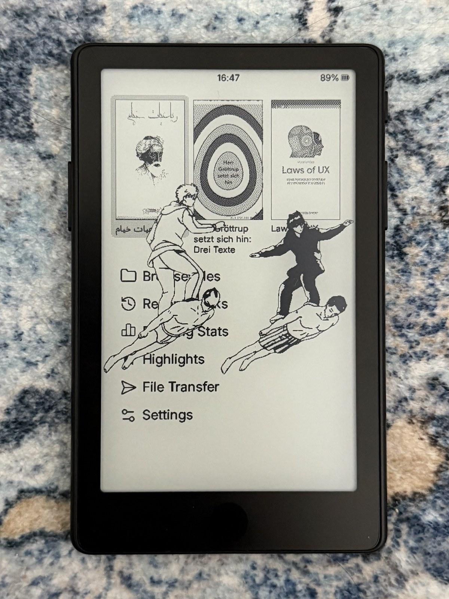
</p>

**VARAGH** (ورق, Persian for "a sheet / a page") is e-reader firmware for the
**Xteink X4 Pro**, built for reading and learning in **English, German and Persian**.
It is a fork of [CrossInk](https://github.com/uxjulia/crossink), itself a fork of
[CrossPoint Reader](https://github.com/crosspoint-reader/crosspoint-reader); all of
their features are kept.

> VARAGH is an independent community project, not affiliated with or endorsed by
> Xteink, CrossInk or CrossPoint.

## New in 1.2.0 "Tiger"

- **Apps on the Home screen:** Wordle, Sudoku, Chess, Checkers and a Clock with
  a calendar, made for the touch screen. Hide the ones you do not use.
- **Online dictionary:** look a word up on Wiktionary in English, German or
  Persian from inside a book; every answer is kept for offline use. With the
  optional **Keep Wi-Fi On** a new word takes a few seconds.
- **Faster Home:** the Carousel follows a swipe at once, and every theme paints
  Home once instead of two or three times.
- **Clock & Calendar sleep screen**, with the Persian date.

<table>
  <tr>
    <td align="center" width="33%">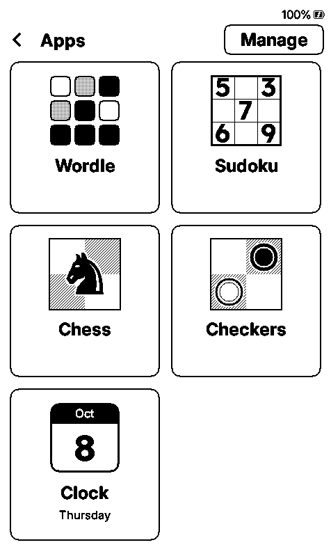<br><b>Apps</b></td>
    <td align="center" width="33%">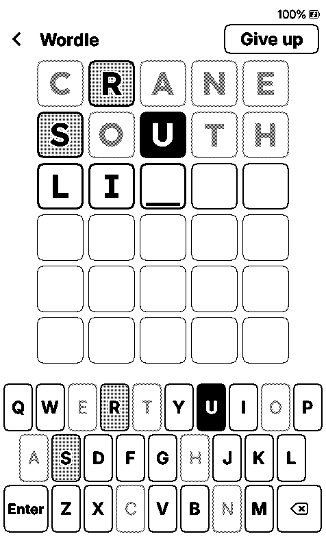<br><b>Wordle</b></td>
    <td align="center" width="33%">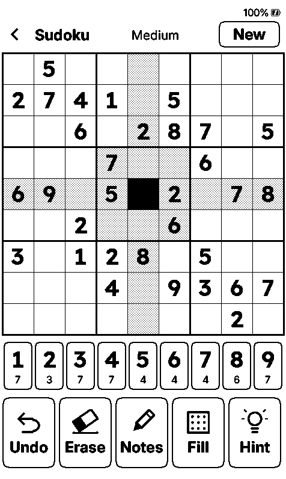<br><b>Sudoku</b></td>
  </tr>
  <tr>
    <td align="center" width="33%"><br><b>Chess</b></td>
    <td align="center" width="33%">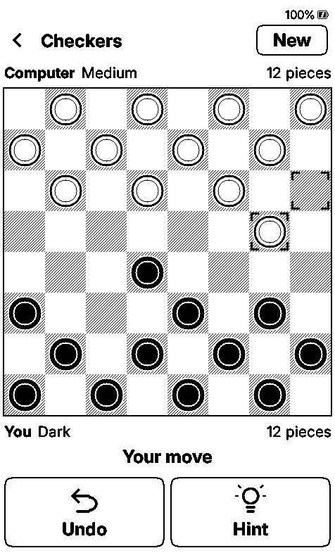<br><b>Checkers</b></td>
    <td align="center" width="33%">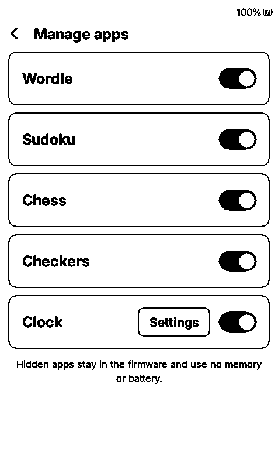<br><b>Manage</b></td>
  </tr>
  <tr>
    <td align="center" width="33%">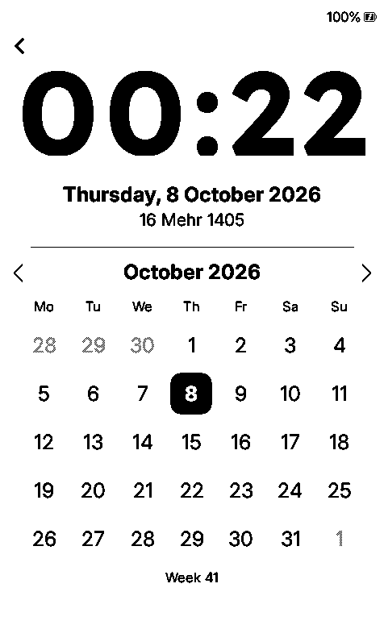<br><b>Clock: large digits</b></td>
    <td align="center" width="33%">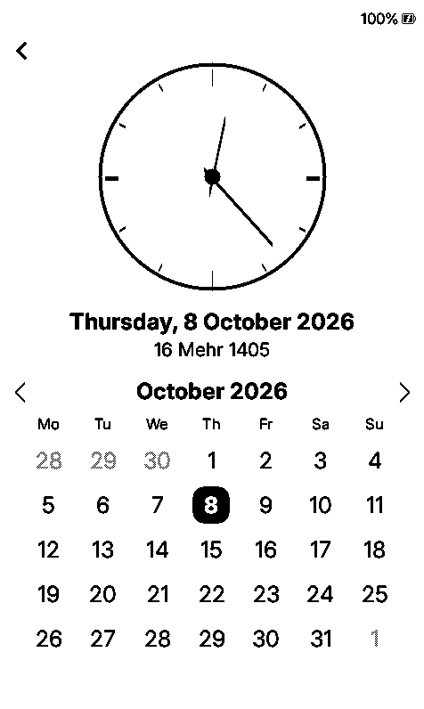<br><b>Clock: analog</b></td>
    <td align="center" width="33%">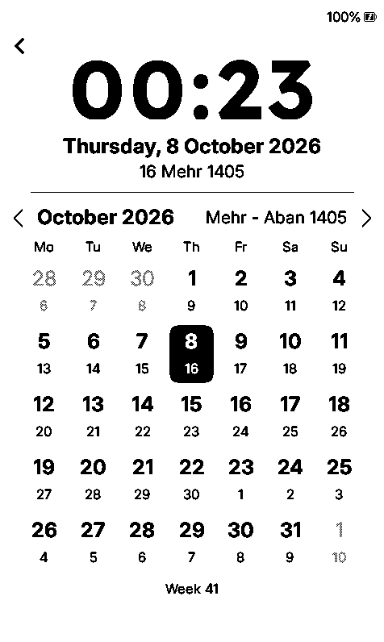<br><b>Clock: Persian days</b></td>
  </tr>
  <tr>
    <td align="center" width="33%">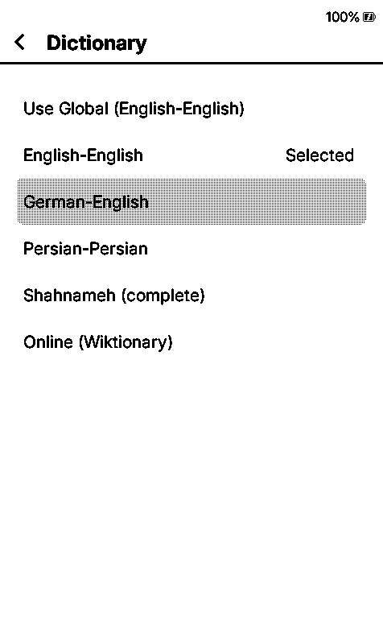<br><b>Switch Dictionary → Online</b></td>
    <td align="center" width="33%">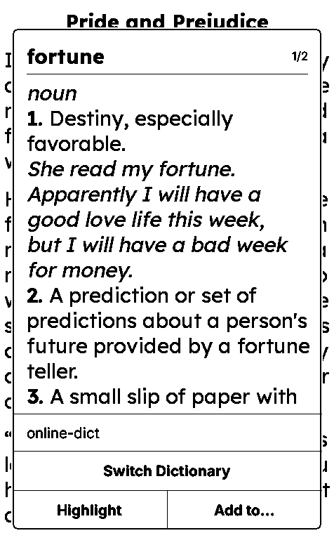<br><b>Online dictionary</b></td>
    <td align="center" width="33%">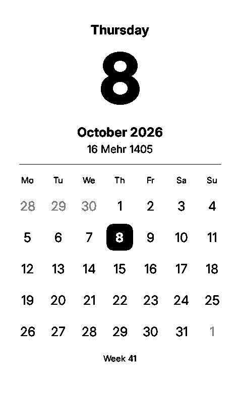<br><b>Clock &amp; Calendar sleep screen</b></td>
  </tr>
</table>

<sub>Screens captured from the 1.2.0 firmware running in the PC simulator.</sub>

## Since 1.1.0 "Tiger"

- **Smoother, sharper pictures in books:** no more crosshatch pattern, clean white paper.
- **Chapters open faster:** long chapters show their first page right away
  (new Indexing Method **Automatic**), no "Indexing" popup for normal chapters,
  a faster SD card and fonts kept in memory.
- **Battery:** the processor slows down sooner, and buttons still respond instantly.

<p align="center">
  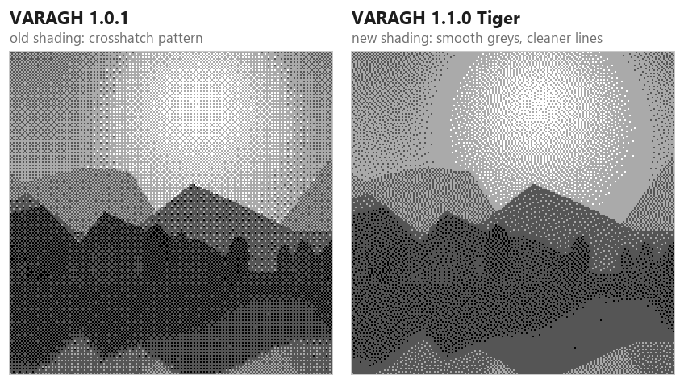
</p>

All changes: [CHANGELOG.md](CHANGELOG.md).

## Features

- **Persian and Arabic:** books switch to a font that can show them, and Persian
  words and pronunciations display correctly with any reader font (NotoVazir).
- **German → English dictionary:** finds the dictionary form of inflected words,
  with pronunciations.
- **Highlights and flashcards:** Favorite Lines, your own categories, **Add to…**
  from the dictionary, flashcards with *Again* / *Know it*.
- **Online dictionary:** Wiktionary and Wikipedia over Wi-Fi, saved on the card
  after the first lookup.
- **Apps:** Wordle, Sudoku, Chess, Checkers, Clock & Calendar.
- **Touch:** adjustable hold to select, selection handles, swipe left to delete.
- **Battery and speed:** the display powers down when idle, smoother pictures,
  faster chapters.

<table>
  <tr>
    <td align="center" width="33%">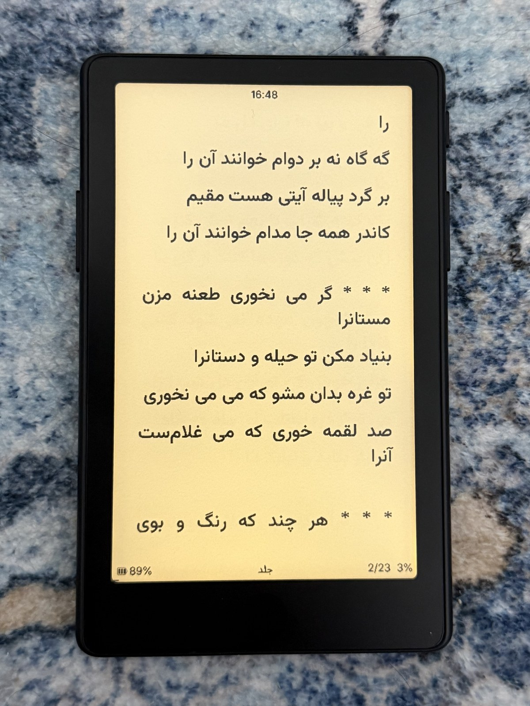<br><b>Persian books</b></td>
    <td align="center" width="33%">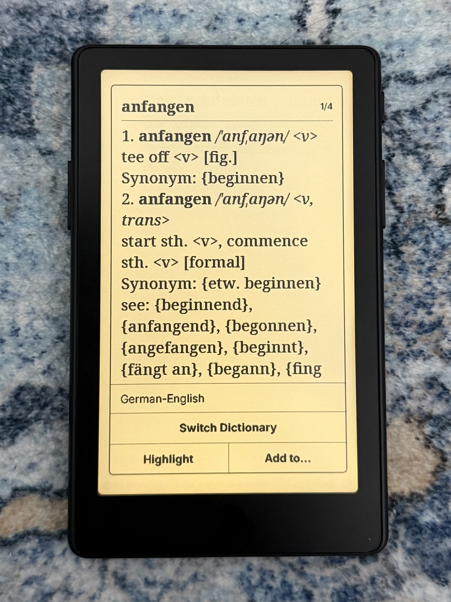<br><b>German → English</b></td>
    <td align="center" width="33%">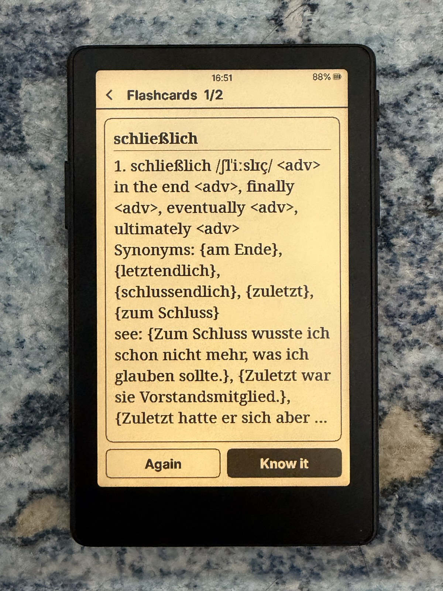<br><b>Flashcards</b></td>
  </tr>
</table>

Every feature, with photos and how to use it: **[FEATURES.md](FEATURES.md)**.

## Install

1. Download `firmware-x4-pro.bin` from the latest
   [release](https://github.com/PewPewzxc/varagh/releases), copy it to the SD card and
   flash it from **Settings → System → SD Card Firmware Update**
   (coming from the original Xteink firmware, see the
   [installation guide](docs/installation.md) first).
2. From the same release, copy the `.fonts/NotoVazir` folder of
   `varagh-sd-card-*.zip` to `/.fonts/NotoVazir/` on the SD card.
3. Select **Settings → Reader → Font Options → Font Family → NotoVazir**.
4. Optional German → English dictionary: see [Dictionaries](docs/varagh/DICTIONARIES.md).

**Updating:** Settings → System → Check for Updates installs the newest VARAGH
release (from 1.0.0, update from the SD card once). Only install VARAGH firmware:
a CrossInk or CrossPoint release replaces VARAGH, and the reader warns you first.

## Build from source

Download `varagh-*-full-source.zip` from a release (it includes the display
library VARAGH uses), unpack it and run:

```bash
pio run -e x4-pro
```

The firmware is written to `.pio/build/x4-pro/firmware-x4-pro.bin`.
Developer notes: [docs/development](docs/development),
[keeping up with CrossInk](docs/varagh/UPSTREAM-SYNC.md).

## Credits and licences

VARAGH is released under the [MIT licence](LICENSE), like CrossInk and CrossPoint.
Third-party code, fonts and data are listed in [THIRD_PARTY_NOTICES.md](THIRD_PARTY_NOTICES.md).

- CrossPoint Reader: Dave Allie and contributors; CrossInk: uxjulia and contributors
- FreeInk SDK (display and UI library): FreeInk
- Fonts: Noto (Google / Noto Project Authors), Vazirmatn (Saber Rastikerdar and the
  Vazirmatn Project Authors), Inter (Rasmus Andersson and the Inter Project Authors)
- Speed ideas in 1.1.0 were inspired by studying
  [microreader](https://github.com/CidVonHighwind/microreader) (no code copied).
- VARAGH was co-authored by Claude (Anthropic).

Dictionary data is not included; see [Dictionaries](docs/varagh/DICTIONARIES.md).
